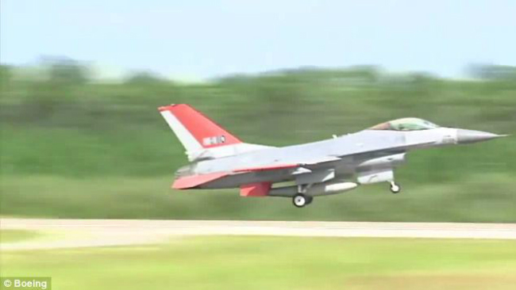

# Boeing переделал истребитель F-16 в беспилотник

Полеты истребителей F-16 ВВС США на базе Тиндалл во Флориде — в порядке
вещей. Однако на этой неделе один из истребителей с ревом ушел в небо без
пилота. Испытательный полет совершил списанный F-16, переоборудованный
авиастроительным концерном Boeing в беспилотный летательный аппарат,
пишет британская газета Daily Mail.

Истребитель, возрожденный под именем QF-16 Full Scale Aerial
Target (QF-16s), предназначен для тренировки будущих американских пилотов
в условиях, максимально приближенных к реальности.

Истребителем удаленно управляли два американских летчика-испытателя.
Поднявшись в небо, QF-16s совершил несколько маневров на сверхзвуковой
скорости, после чего успешно приземлился на базу.

https://www.youtube.com/watch?v=XAYE-KmOw40

>Непривычно видеть самолет без пилота. Тем не менее, это был отличный
>полет по всем параметрам, — делится впечатлениями подполковник ВВС США
>Райан Инман.

До истребителя QF-16 на вооружении ВВС США стоял QF-4 — модернизированный
F-4 Phantom.

Следующий тест беспилотного QF-16s пройдет на авиационной базе Голломан в
Нью-Мексико. Военные планируют испытания бортового оружия. На сегодняшний
день Boeing переоборудовал в БЛП шесть QF-16.

Источник: http://hi-news.ru/technology/boeing-peredelal-istrebitel-f-16-v-bespilotnik.html
