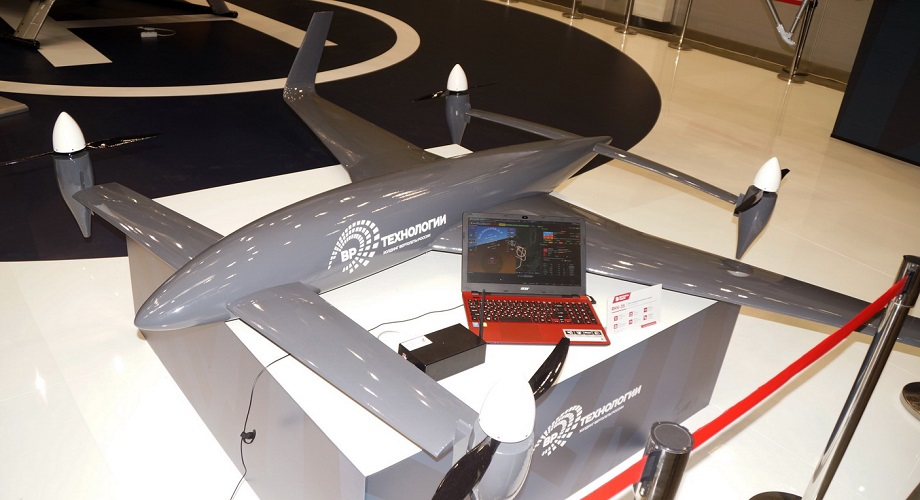
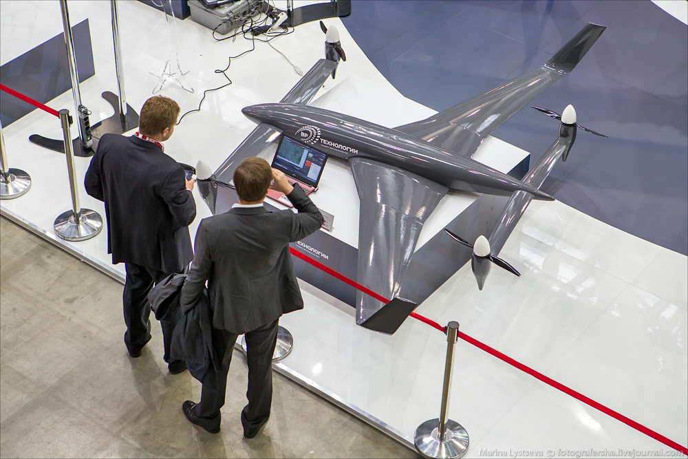
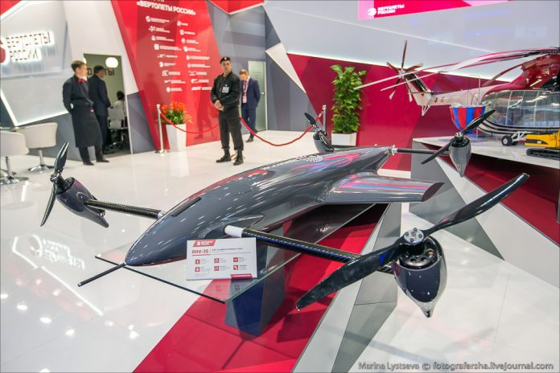
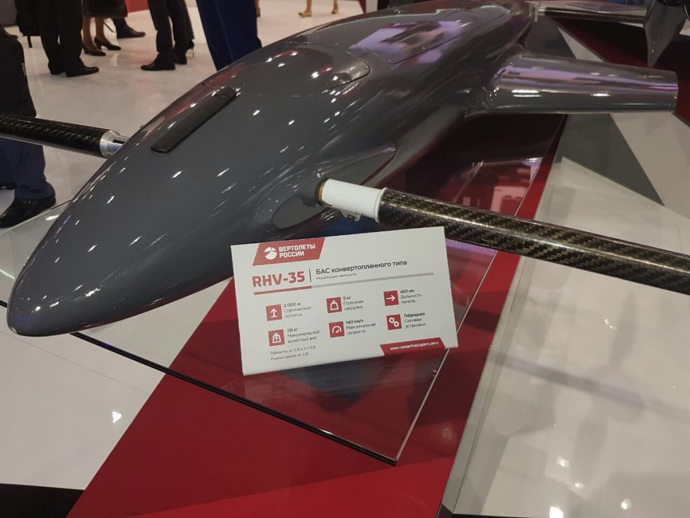

# RHV-35, беспилотный конвертоплан, Россия

Дрон RHV-35 предназначен для решения задач, связанных с осуществлением
охраны окружающей среды, проведением мероприятий по контролю над
экологической обстановкой и ведением аэрофотосъёмки. Кроме того,
беспилотник может применяться для доставки небольших грузов, например,
медикаментов в труднодоступные районы.

## Технические характеристики

Параметр                                      | Значение
----------------------------------------------|---------
Взлётная масса, кг                            | 35
Масса полезной нагрузки, кг                   | 5 — 6
Размах крыла, м                               | 2.8
Длина, м                                      | 2.0
Статический потолок, м                        | 2000
Дальность полёта, км                          | около 450
Максимальная скорость полёта, км/ч            | 140

В основе конструкции БЛА-конвертоплана RHV-35 — несущее крыло с
вертикальными законцовками, что способствует, по словам разработчиков,
увеличению дальности, а также лучшей стабилизации аппарата на переходных
режимах полета. Такая «самолетная» схема не случайна — в ней
прослеживаются черты беспилотника «Аэроб-4Д»: подразделение
«ВР-Технологии» уже почти год сотрудничает с компанией «Аэроб» Андрея
Мамонтова. По крайней мере, по бортовому оборудованию.

## Новости

**06.09.2016**. Новый беспилотник RHV-35 представили на стенде
HeliRussia-2016, и на международном военно-техническом форуме АРМИЯ-2016.

**12.07.2016**. Холдинг «Вертолеты России» (входит в госкорпорацию
Ростех) представил в рамках промышленной выставки «Иннопром-2016»,
проходящей с 11 по 14 июля в Екатеринбурге (Россия), беспилотный
конвертоплан RHV-35.

## Источники

- [Беспилотная авиационная система конвертопланного типа RHV-35](http://sdelanounas.ru/blogs/82904/) (07.09.2016)
- [Russia develops unmanned aerial vehicle that looks like a drone from Terminator](http://defence-blog.com/news/russia-develops-unmanned-aerial-vehicle-that-looks-like-a-drone-from-terminator.html) (06.09.2016)
- [Российский дрон-конвертоплан RHV-35 развивает скорость до 140 км/ч](http://www.3dnews.ru/935970) (12.07.2016)
- [«ВР-Технологии» на HeliRussia-2016](https://missiles2go.ru/2016/05/19/вр-технологии-на-helirussia-2016/) (19.05.2016)
- [Новый российский беспилотник-конвертоплан RHV-35](http://quadrocopters.su/novosti/novyj-rossijskij-bespilotnik-konvertoplan-rhv-35)
