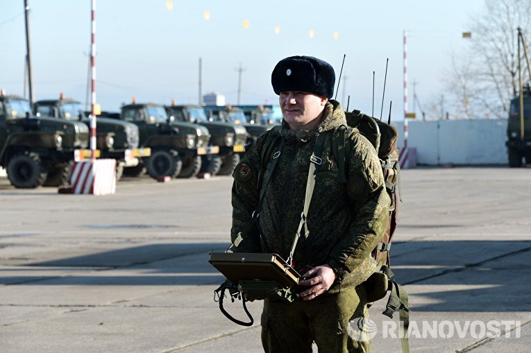

# В Сирию прибыла вторая группа российских саперов с роботами «Уран-6»

На российскую авиабазу Хмеймим в Сирии переброшена вторая группа саперов,
которая будет привлечена к разминированию Пальмиры. Об этом сообщили в
Минобороны РФ.

Вместе с группой прибыли робототехнические комплексы разминирования
«Уран-6». Кроме того, переброшены специализированные бронетранспортеры,
оснащенные подавителями радиовзрывателей и радиоуправляемых фугасов.

Первая группа российских саперов находится в Сирии с 29-30 марта.

Отступая из Пальмиры, боевики «Исламского государства» (ИГ) разрушили
большую часть архитектурных памятников мирового значения, а остальные
заминировали. Президент России Владимир Путин 27 марта в разговоре с
гендиректором ЮНЕСКО Ириной Боковой сообщил, что поручил российскому
контингенту в Сирии принять участие в разминировании города.

По предварительным оценкам российских военных, предстоит очистить от
взрывоопасных предметов свыше 180 гектаров в исторической и жилой частях
города.

Античный город Пальмира — памятник Всемирного наследия ЮНЕСКО — оказался
под контролем террористов ИГ в мае 2015 года. В воскресенье, 27 марта,
сирийские военные объявили, что армейские подразделения при поддержке
сирийской и российской авиации вернули контроль над городом.

Организация «Исламское государство» признана террористической и запрещена
в РФ в соответствии с решением Верховного суда АКПИ 14-1424 от 29 декабря
2014 года.

https://lenta.ru/news/2016/04/01/sapper/
