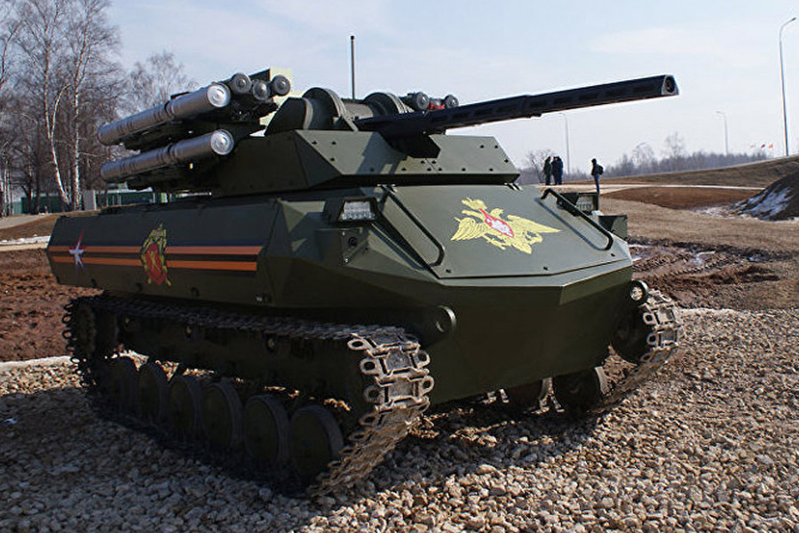
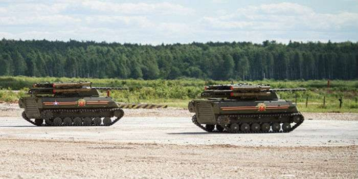
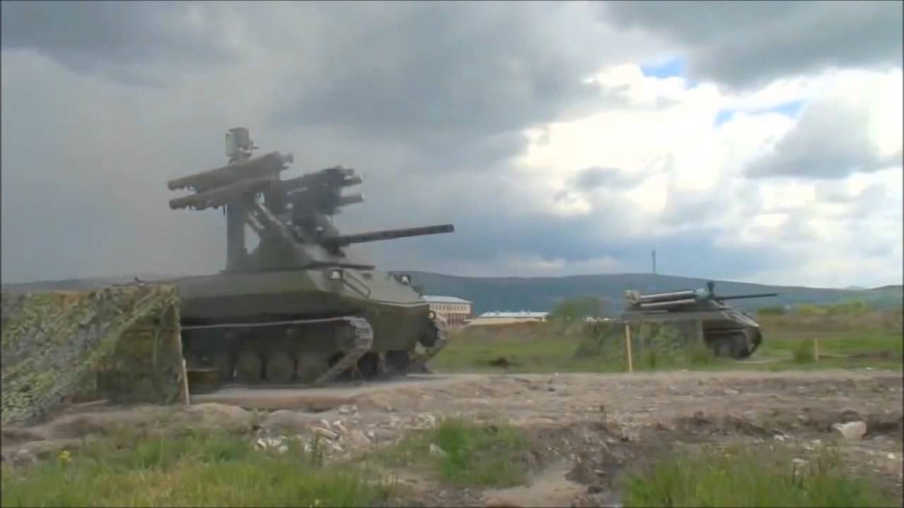
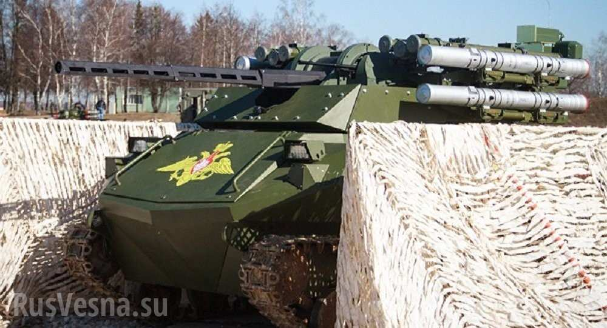

# Уран-9, роботизированный боевой комплекс, Россия

«Уран-9» предназначен для дистанционной разведки и огневой поддержки 
общевойсковых, разведывательных и антитеррористических подразделений. В 
его состав входят два робота разведки и огневой поддержки, тягач для их 
транспортировки и подвижный пункт управления.

## Характеристики

- Масса: около 10 тонн

## Вооружение

- автоматическая пушка 2A72, калибр 30 миллиметров;
- спаренный с ней пулетмёт, калибр 7,62 миллиметров;
- ПТУР М120 системы "Атака".

<https://www.youtube.com/watch?v=HE3f7oNFTlE>

<iframe width="560" height="315" src="https://www.youtube.com/embed/HE3f7oNFTlE" frameborder="0" allowfullscreen></iframe>

## Новости

[Новости](news/)

- [09.09.2016 Минобороны анонсировало испытания боевого робота «Уран-9»](news/2016-0909-announced.md)

## Фотографии

[Фотографии](img/)

## Ссылки

- [Россия будет продвигать на мировой рынок боевого робота «Уран-9»](https://ria.ru/defense_safety/20151230/1351580959.html) (30.12.2015)
- [Робот Уран-9 - новый боевой комплекс России для Третьей мировой войны](http://www.3world-war.su/vooruzhenie/vooruzhenie-rossii/1275-robot-uran-9-novyj-boevoj-kompleks-rossii-dlja.html)
