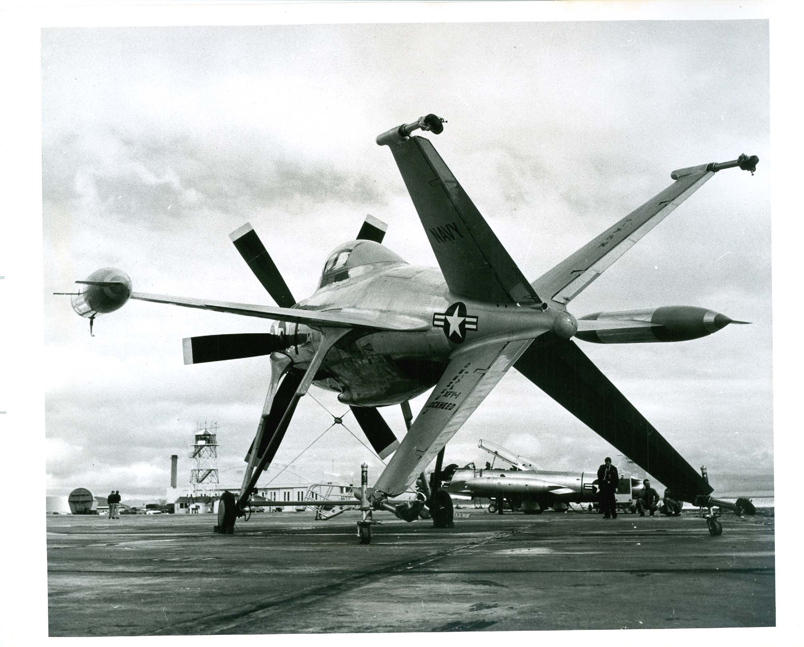

# Lockheed XFV-1

XFV-1 — экспериментальный турбовинтовой самолёт-истребитель вертикального
взлёта и посадки, созданный в начале 1950-х годов фирмой Lockheed.

В 1950 году ВМС США выпустило техническое задание на истребитель
вертикального взлёта и посадки, способный размещаться на обычных кораблях
(не авианосцах) с целью обороны морских конвоев от атак с воздуха. Две
фирмы: Convair и Lockheed разработали для удовлетворения этого ТЗ
самолёты XFY-1 и XFV-1, соответственно. Оба самолёта были оснащёны одним
турбовинтовым двигателем и должны были взлетать и садиться, повернув свою
продольную ось в вертикальное положение, то есть на хвост (см. рисунок).
Испытания самолёта XFV-1 начались в марте 1954 года. На начальном этапе
испытаний было решено производить взлёт и посадку традиционным для
самолёта способом, для чего к нему были пристыкованы опоры временного
шасси. Позднее был выполнен ряд успешных вертикальных взлётов с переходом
в горизонтальный полёт и посадок. Однако ВМС США закрыли программу, и
серийное производство самолёта так и не началось.

## Ссылки

- https://ru.wikipedia.org/wiki/Lockheed_XFV-1
- http://www.balancer.ru/g/p1357028
- http://www.balancer.ru/g/p1897236
- http://www.balancer.ru/g/p2264864
- http://www.balancer.ru/g/p4187264
- http://igor113.livejournal.com/106857.html
